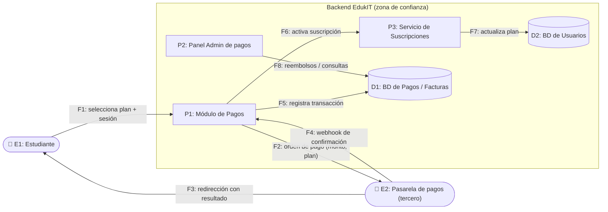

# 🗒️ Registro de Trabajo en Clase - Taller 5

## 📆 Fecha de la sesión
_(Completar: fecha de la clase del Taller 5)_

## 👥 Integrantes presentes
- _(Completar)_ — nicoclo205
- _(Completar)_
- _(Completar)_

## 🧠 Actividades realizadas en clase

- **Qué se discutió:** qué flujo de EdukIT analizar. La guía ya trae como ejemplo resuelto el flujo de *acceso a cursos*, así que elegimos otro para no repetirlo: **procesamiento de pagos de suscripción con una pasarela externa**. Tiene dinero de por medio, datos personales y un tercero fuera de nuestro control.
- **Decisiones de modelado:**
  - Dos límites de confianza: el navegador del estudiante (no confiable) y la pasarela de pagos (tercero). El backend de EdukIT queda en la zona de confianza.
  - El webhook de la pasarela se modela como un flujo de entrada desde fuera del límite. Cualquiera puede llamarlo, así que es candidato a *Spoofing*.
  - No se guardan números de tarjeta: se supone tokenización en la pasarela. Aun así, la BD de pagos tiene datos de facturación y personales.
- **Herramientas:** tablero y papel para el primer boceto, Mermaid para el DFD final, y la plantilla oficial `plantilla_analisis_stride.xlsx` para la tabla.
- **Qué se alcanzó:** DFD, identificación de elementos, las 6 categorías STRIDE (7 amenazas), impacto, probabilidad, priorización y la relación con los retos de OWASP Juice Shop. El resultado está en [`tabla-stride-clase.xlsx`](tabla-stride-clase.xlsx).

## 🧩 Boceto inicial del modelo

### Paso 1 — DFD: pago de suscripción en EdukIT

### Paso 2 — Elementos analizados

| ID | Elemento | Tipo |
|---|---|---|
| E1 | Estudiante | Actor externo |
| E2 | Pasarela de pagos | Entidad externa (tercero) |
| P1 | Módulo de Pagos | Proceso |
| P2 | Panel de Administración de pagos | Proceso |
| P3 | Servicio de Suscripciones | Proceso |
| D1 | BD de Pagos / Facturas | Almacén de datos |
| D2 | BD de Usuarios | Almacén de datos |
| F1–F8 | Flujos entre los anteriores | Flujo |

### Pasos 3 a 5 — Resultado priorizado

La tabla completa, con las 12 columnas oficiales, está en [`tabla-stride-clase.xlsx`](tabla-stride-clase.xlsx) (hojas `Plantilla_STRIDE`, `Priorizacion` y `Matriz_Riesgo`).

| Prioridad | ID | Tipo STRIDE | Componente | Riesgo |
|---|---|---|---|---|
| 1 | T1 | Spoofing | Formulario de pago (F1) | **Alto** |
| 2 | T2 | Tampering | Solicitud de pago (F2) — monto | **Alto** |
| 3 | T5 | Information Disclosure | BD de Pagos (D1) — facturas (IDOR) | **Alto** |
| 4 | T3 | Spoofing | Webhook de la pasarela (F4) | Medio |
| 5 | T4 | Repudiation | Módulo de Pagos (P1) — historial | Medio |
| 6 | T6 | Denial of Service | Módulo de Pagos / Pasarela | Medio |
| 7 | T7 | Elevation of Privilege | Panel Admin de pagos (P2) | Medio |

Regla de riesgo: Impacto × Probabilidad, la misma que usa la guía (Alto×Media = Alto, Alto×Baja = Medio, Medio×Media = Medio, Medio×Baja = Bajo, Alto×Alta = Crítico).

### Relación con OWASP Juice Shop

| Reto de Juice Shop | Fila de nuestra tabla | Control que faltaba | Mitigación |
|---|---|---|---|
| Reto 2 — Precio manipulado (Tampering) | **T2** — el monto viaja desde el navegador | El servidor confía en el precio del cliente | Recalcular el monto en el servidor desde el catálogo de planes |
| Reto 3 — Carrito ajeno (Information Disclosure) | **T5** — factura de otro estudiante por ID | No se valida la propiedad del recurso (IDOR) | Verificar en el servidor que el recurso pertenece al usuario autenticado |
| Reto 4 — Panel admin (Elevation of Privilege) | **T7** — panel de pagos solo oculto en la UI | Control de acceso solo en el frontend | RBAC validado en cada endpoint del backend |

> 📸 **Evidencia del reto:** el equipo debe adjuntar aquí la captura del reto que resolvió en su propia instancia local de Juice Shop (por ejemplo, `clase/evidencia-juice-shop.png`) y anotar qué pasó al intentarlo.

## 🔁 Tareas definidas para complementar el taller

| Tarea asignada | Responsable | Fecha estimada |
|----------------|-------------|----------------|
| Entrevista con el cliente real (Asul) y transcripción | Todo el equipo | _(completar)_ |
| Tabla STRIDE del cliente (`entrega/tabla-stride-cliente.xlsx`) | _(completar)_ | _(completar)_ |
| Redacción del informe (`entrega/informe.md`) | _(completar)_ | _(completar)_ |
| Investigación de normativa del sector asegurador y referencias | _(completar)_ | _(completar)_ |
| Evidencia del reto de Juice Shop (captura) | _(completar)_ | _(completar)_ |

---

_Este documento resume el trabajo colaborativo realizado durante la sesión del Taller 5 en el curso AREM - Universidad de La Sabana._
