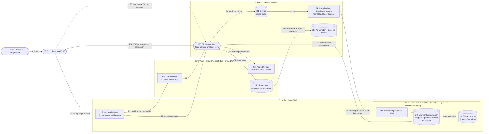
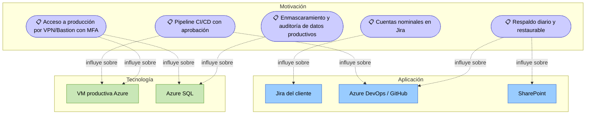

# 📄 Informe Técnico del Taller

## 🔖 Nombre del Taller
_Taller 5 - Evaluación de Seguridad con STRIDE: ecosistema de desarrollo y soporte de Asul_

## 👥 Integrantes del equipo
- _(Completar)_ — nicoclo205
- _(Completar)_
- _(Completar)_

## 🧠 Descripción general del trabajo

El objetivo del taller fue aplicar el marco **STRIDE** a una parte crítica de un sistema real. En clase (Parte 1) lo practicamos sobre el caso base **EdukIT**, con el flujo de pagos de suscripción (ver [`clase/notas.md`](../clase/notas.md) y [`clase/tabla-stride-clase.xlsx`](../clase/tabla-stride-clase.xlsx)). Después (Parte 2) lo aplicamos a nuestro cliente real, **Asul**.

**Asul** es una empresa colombiana de desarrollo de software con un equipo de menos de 10 personas. Presta servicios de desarrollo, soporte y administración de infraestructura en la nube a clientes corporativos. Su cliente principal en la entrevista, **SBS**, pertenece al **sector asegurador**. Por eso Asul maneja, de forma indirecta, datos de pólizas y de asegurados.

Hicimos una entrevista semiestructurada de unos 24 minutos a una persona de Asul del área de gestión de proyectos y procesos. A partir de la transcripción modelamos el **ciclo de vida de una solicitud del cliente**: desde que se crea un ticket en el Jira del cliente hasta que el cambio queda desplegado en producción en Azure. Luego aplicamos las 6 categorías STRIDE sobre ese flujo.

**Entregables:**
- [`entrega/tabla-stride-cliente.xlsx`](tabla-stride-cliente.xlsx): 16 amenazas con las 12 columnas oficiales, más las hojas `Priorizacion`, `Matriz_Riesgo` y `Notas`.
- Este informe.
- [`entrega/referencias.md`](referencias.md).

## 🔧 Proceso de desarrollo

1. **Entrevista y transcripción.** La transcripción automática tiene muchos errores fonéticos. Antes de analizar, normalizamos los términos:

   | En la transcripción | Interpretación |
   |---|---|
   | "Asher de bobs", "ashure de bops", "ciudad de box" | **Azure DevOps** |
   | "cherpoint", "sharpoin", "Shore" | **SharePoint** |
   | "gira" | **Jira** (del cliente) |
   | "Rentech" | Nombre de la cuenta o equipo de Asul configurado en el Jira del cliente (supuesto) |
   | "6 square", "ashurt ese cuele" | **Azure SQL Database** |
   | "money monitor de ashur" | **Azure Monitor** |
   | "PPN", "BPMS", "epn" | **VPN** |
   | "directorio activo… Microsoft 365" | **Microsoft Entra ID** (antes Azure AD) con dominio propio |
   | "knock / shock" | **NOC / SOC** del proveedor de ciberseguridad del cliente |
   | "abeas data", "15:00 81" | Habeas data, **Ley 1581 de 2012** |
   | "ISO 27000… 2012" | Controles de **ISO/IEC 27002:2013** aplicados como buenas prácticas, sin certificación ISO/IEC 27001 |

2. **Selección del flujo.** Elegimos el flujo de *solicitud → ticket → desarrollo → despliegue* porque cruza tres límites de confianza (cliente, Asul e internet), toca los datos más sensibles (producción del asegurador) y concentra los hallazgos más relevantes de la entrevista: cuenta compartida, despliegue manual y aprobaciones por correo.
3. **DFD.** Lo dibujamos en Mermaid (ver abajo) con los actores, procesos, almacenes y flujos descritos en la entrevista.
4. **STRIDE por elemento.** Recorrimos cada elemento con las 6 categorías usando la matriz STRIDE por tipo de elemento de la guía. Cada amenaza quedó ligada a algo que el entrevistado dijo (columna *Controles de Seguridad Existentes*).
5. **Riesgo y priorización.** Usamos la misma matriz Impacto × Probabilidad de la guía, con el nivel **Crítico** para Alto × Alta.
6. **Investigación.** Revisamos la normativa colombiana y del sector asegurador y los marcos de referencia aplicables (sección de investigación y [`referencias.md`](referencias.md)).

**Herramientas:** transcripción automática, Mermaid, Excel (plantilla oficial) y Markdown en GitHub.

## 🧩 Análisis del modelo propuesto

### Contexto relevado en la entrevista

| Tema | Lo que dijo Asul |
|---|---|
| Personas con acceso a Azure DevOps (soporte) | El líder técnico (Alejandro) y un analista de sistemas. En proyectos, todo el equipo de desarrollo. |
| Entrada de solicitudes | El usuario final del cliente crea el ticket en Jira. El **primer nivel de SBS** lo analiza y lo asigna a Asul. |
| Notificación | Llega un **correo** cada vez que un ticket se asigna o menciona a Asul. Luego se **transcribe manualmente** a Azure DevOps. |
| Otras herramientas | Teams (comunicación), un complemento **Time Tracker** en Azure DevOps (tiempos), SharePoint (documentos), GitHub (código). |
| Cuenta de Jira | **Compartida:** el cliente dio una sola licencia, a nombre del líder técnico, y todo el equipo la usa. |
| Requisitos y estimaciones | Documento Word, luego PDF, enviado por correo. El cliente **aprueba respondiendo el correo**. En SharePoint se manejan **líneas base** (1.0, 2.0) y borradores (1.1, 1.2). No están bloqueadas, pero hay trazabilidad. |
| CI/CD | **No se usa**: la compilación y el despliegue son **manuales**. Está pendiente implementarlo. |
| Despliegues a producción | Casi siempre el **líder técnico**. Hay dos personas capacitadas como respaldo. |
| Infraestructura | 100 % en **Azure**, con máquinas virtuales. Base de datos **Azure SQL** con 2 réplicas (una para reportes y otra en espera). Regiones **East US y West US** con replicación y pruebas de recuperación ante desastres. |
| Hosting por cliente | SBS: Asul administra el ambiente productivo del cliente. Otro cliente (SMPPI): Asul lo aloja y administra al 100 %. |
| Acceso de red | Ambientes UAT y producción de SBS restringidos por **lista blanca de IP**. El cliente usa VPN; Asul no tiene acceso a esa VPN. |
| Estaciones de trabajo | Cada desarrollador trabaja en su **computador propio**. |
| Identidad | Azure DevOps integrado con Entra ID / Microsoft 365. **MFA habilitado** en todas las cuentas Microsoft. Roles de **administrador y contribuyente**. |
| Respaldos | SharePoint se sincroniza a un computador que hace de servidor, con copia **semanal** a otro disco. **Azure DevOps no tiene respaldo propio.** |
| Monitoreo | **Azure Monitor**, instalado a pedido del cliente. El cliente tiene un **proveedor de ciberseguridad con SOC** que alerta por correo sobre IP de otros países y picos de tráfico. |
| Datos del cliente | Acceso a la **BD productiva**. Se **ofuscan** los datos al copiarlos a pruebas. Cláusula de confidencialidad con el cliente. |
| Datos personales propios | Política de habeas data **publicada** en la web y procedimiento para ejercer derechos (Ley 1581 de 2012). |
| Marco de seguridad | Sin certificación **ISO 27001**. Controles de ISO 27002 como buenas prácticas. |
| Fuga de código o documentos | Solo **políticas** y cláusulas. No recuerdan un control técnico que impida descargas. |
| Retención | El código se guarda **indefinidamente** en discos de backup. **No hay procedimiento de eliminación.** |
| Concienciación | Cláusula de confidencialidad al ingresar, capacitaciones y **auditoría interna cada 6 meses** (escritorio limpio, contraseñas). |
| Incidentes | No reportan incidentes de seguridad en los últimos años. |

### Paso 1 — DFD del flujo analizado

**Límites de confianza:**
1. Entre el cliente (Jira, primer nivel, Azure productivo) y Asul.
2. Entre el tenant corporativo de Asul (con MFA y Entra ID) y los equipos propios, GitHub y los discos de backup, donde los controles son sobre todo de política.
3. Entre internet y la producción del cliente, protegido solo por la lista blanca de IP.

### Paso 2 — Elementos analizados

| ID | Elemento | Tipo | Responsable |
|---|---|---|---|
| E1 | Primer nivel de soporte de SBS | Actor externo | Cliente |
| E2 | Equipo Asul (líder técnico, analista de sistemas, desarrolladores, QA) | Actor interno | Asul |
| P1 | Jira del cliente, con la cuenta compartida de Asul | Proceso (sistema externo) | Cliente / Asul |
| P2 | Correo Microsoft 365 (notificaciones) | Proceso | Asul |
| P3 | Azure DevOps (Boards, Time Tracker) | Proceso | Asul |
| P4 | Compilación y despliegue manual | Proceso | Líder técnico |
| P5 | Aplicación productiva en VM de Azure | Proceso | Asul (administración) |
| D1 | Repositorios GitHub | Almacén de datos | Asul |
| D2 | SharePoint (requisitos, líneas base) | Almacén de datos | Asul |
| D3 | Azure SQL de producción y réplicas | Almacén de datos | Asul / Cliente |
| D4 | BD de pruebas con datos ofuscados | Almacén de datos | Asul |
| D5 | Computador servidor y discos de backup | Almacén de datos | Asul |
| F1–F9 | Flujos de datos del DFD | Flujo | — |

### Pasos 3 y 4 — Amenazas STRIDE (resumen)

La tabla completa, con escenario de ataque, controles existentes, mitigación, responsable y estado, está en [`tabla-stride-cliente.xlsx`](tabla-stride-cliente.xlsx). Resumen por categoría:

| STRIDE | Amenazas | Hallazgo principal |
|---|---|---|
| **Spoofing** | T1, T10, T16 | La **cuenta compartida de Jira** hace que cualquier persona con la contraseña actúe como el líder técnico. Las aprobaciones por correo se pueden suplantar. |
| **Tampering** | T5, T12 | Se **despliega desde un portátil sin pipeline**: nada garantiza que lo que corre en producción sea lo revisado. La línea base de requisitos no está bloqueada. |
| **Repudiation** | T2, T6, T11 | No se puede atribuir una acción en Jira a una persona, no hay registro formal de despliegues y las aprobaciones del cliente no tienen firma. |
| **Information Disclosure** | T3, T13, T14 | **Acceso directo a la BD productiva** con datos de asegurados, sin control técnico contra la descarga de código o datos, y **retención indefinida** en discos de backup. |
| **Denial of Service** | T7, T8, T9 | Dependencia de **una sola persona** para desplegar, **Azure DevOps sin respaldo**, SharePoint con copia semanal y tickets que dependen de un correo. |
| **Elevation of Privilege** | T4, T15 | La **lista blanca de IP residenciales** es un perímetro frágil. Los roles de Azure DevOps no se revisan periódicamente. |

### Paso 5 — Priorización

| Prioridad | ID | STRIDE | Componente | Riesgo |
|---|---|---|---|---|
| 1 | T1 | Spoofing | Cuenta compartida de Jira | 🟥 **Crítico** |
| 2 | T2 | Repudiation | Cuenta compartida de Jira — historial | 🟧 **Alto** |
| 3 | T3 | Information Disclosure | Azure SQL de producción (datos de asegurados) | 🟧 **Alto** |
| 4 | T4 | Elevation of Privilege | Lista blanca de IP públicas | 🟧 **Alto** |
| 5 | T5 | Tampering | Despliegue manual sin pipeline | 🟧 **Alto** |
| 6 | T6 | Repudiation | Despliegue sin registro | 🟧 **Alto** |
| 7 | T13 | Information Disclosure | GitHub y equipos propios | 🟧 **Alto** |
| 8 | T7 | Denial of Service | Líder técnico como único desplegador | 🟨 Medio |
| 9 | T8 | Denial of Service | Respaldos de Azure DevOps y SharePoint | 🟨 Medio |
| 10 | T9 | Denial of Service | Notificación por correo y transcripción manual | 🟨 Medio |
| 11 | T10 | Spoofing | Correos de aprobación | 🟨 Medio |
| 12 | T11 | Repudiation | Aprobación sin firma | 🟨 Medio |
| 13 | T14 | Information Disclosure | Discos de backup históricos | 🟨 Medio |
| 14 | T16 | Spoofing | Cuentas Microsoft 365 (phishing) | 🟨 Medio |
| 15 | T12 | Tampering | Línea base de SharePoint editable | 🟩 Bajo |
| 16 | T15 | Elevation of Privilege | Roles de Azure DevOps | 🟩 Bajo |

**Lectura de la priorización.** Los riesgos más altos no vienen de un software vulnerable. Vienen de **decisiones de proceso**: compartir una cuenta para ahorrar licencias, desplegar a mano, confiar en IP residenciales y en correos como evidencia. Eso es una buena noticia para Asul, porque casi todas las mitigaciones prioritarias son de configuración o de acuerdo con el cliente, no de reescribir código.

### Hoja de ruta recomendada

| Horizonte | Acciones | Amenazas que cubre |
|---|---|---|
| **0–30 días (rápido y barato)** | Pedir a SBS cuentas nominales en Jira (o, mientras tanto, guardar la credencial en un gestor con MFA y rotarla). Configurar SPF, DKIM y DMARC. Revisar la lista blanca de IP y los administradores de Azure DevOps. Documentar el runbook de despliegue. | T1, T2, T10, T4, T15, T7 |
| **1–3 meses** | Implementar CI/CD (GitHub Actions o Azure Pipelines) con ramas protegidas y pull requests obligatorios. Registro de cambios automático. Acceso a producción por VPN o Bastion de Asul con IP fija. Respaldo diario de M365 y Azure DevOps con prueba de restauración. | T5, T6, T4, T8 |
| **3–6 meses** | Organización de GitHub con SSO de Entra ID. Gestión de equipos con Intune, cifrado de disco y DLP. Enmascaramiento dinámico y auditoría en Azure SQL. Política de retención y eliminación de código de clientes. Firma electrónica de requisitos. | T13, T3, T14, T11, T12 |
| **6–12 meses** | Integración automática Jira ↔ Azure DevOps. MFA resistente a phishing. Evaluar un SGSI formal alineado con ISO/IEC 27001:2022. | T9, T16 |

### Supuestos tomados

La entrevistada no conocía algunos detalles técnicos. Donde faltó información asumimos escenarios generales y razonables:

1. La transcripción se interpretó como se describe en la tabla de normalización. "Rentech" se tomó como la cuenta o equipo de Asul en el Jira del cliente.
2. **Jira** es la instancia en la nube (Atlassian Cloud) del cliente. No se sabe si la cuenta compartida tiene MFA, así que se asume que **no** está garantizado.
3. **GitHub**: se asume que los repositorios son privados pero en cuentas u organización **sin SSO** ligado a Entra ID. Por eso el MFA de Microsoft no cubre GitHub.
4. **Acceso a producción**: se asume que los desarrolladores trabajan remoto o de forma híbrida desde conexiones con IP dinámica, y que la lista blanca incluye puertos de administración (RDP/SSH/SQL).
5. **Despliegue**: se asume que se compila en el portátil del líder técnico y se copian los artefactos a la VM (Escritorio remoto, Web Deploy o similar).
6. **Computadores propios**: se asume que no están gestionados por la empresa (sin Intune o MDM) y que el cifrado de disco no está garantizado.
7. **Discos de backup**: se asume que no están cifrados, porque la entrevistada no lo mencionó.
8. **Regulación**: la pregunta sobre si el cliente exige normativa de la Superintendencia Financiera quedó sin respuesta. Asumimos que, al ser SBS una aseguradora vigilada, las exigencias de ciberseguridad y de tercerización de la SFC le **aplican a Asul por vía contractual**.
9. La columna *Probabilidad* es un juicio cualitativo del equipo, no una medición.

### Reconocimiento pasivo (sección 5 de la guía)

La mayor parte del flujo corre sobre **servicios SaaS internos** (Jira, Azure DevOps, SharePoint, correo) y sobre ambientes del cliente **restringidos por IP**. Así que casi nada es observable desde afuera sin credenciales. Por eso la columna *Controles de Seguridad Existentes* se basa en la **evidencia de la entrevista**, no en suposiciones del equipo.

Como complemento pasivo, sin credenciales y de solo lectura, el equipo puede revisar sobre el **dominio público de Asul** lo siguiente:

| Qué revisar | Herramienta | Alimenta |
|---|---|---|
| Registros SPF, DKIM y DMARC del dominio de correo | `nslookup -type=txt _dmarc.<dominio>` o [MXToolbox](https://mxtoolbox.com/dmarc.aspx) | T10 (suplantación de correo) |
| Cabeceras HTTP y TLS del sitio web corporativo | [securityheaders.com](https://securityheaders.com), [SSL Labs](https://www.ssllabs.com/ssltest/) | Postura general |
| Política de habeas data publicada | Revisión del sitio web | Cumplimiento de la Ley 1581 |
| Filtraciones asociadas al dominio | [haveibeenpwned.com](https://haveibeenpwned.com/) (búsqueda por dominio, requiere verificar la propiedad) | T1, T16 |

> ⚠️ **No se hizo ninguna prueba activa** contra los sistemas de Asul ni contra los de su cliente. Las técnicas de Juice Shop solo se practican en una instancia local.

### Diferencias con el caso base (EdukIT)

| Aspecto | EdukIT (caso base) | Asul (cliente real) |
|---|---|---|
| **Tipo de sistema** | Plataforma propia de cara al usuario final | Empresa de servicios: el "sistema" es su **cadena de desarrollo, soporte y despliegue**, que atraviesa el tenant del cliente |
| **Superficie de ataque** | Aplicación web: formularios, API, tokens | **Personas, procesos y herramientas SaaS**: cuentas compartidas, correos, despliegues manuales |
| **Origen de las amenazas** | Fallas de validación en el código (inyección, IDOR, rol en el cliente) | **Decisiones operativas** (licencias, falta de CI/CD, IP residenciales) y el riesgo de terceros |
| **Datos sensibles** | Datos de estudiantes, notas y pagos | Datos de **asegurados y pólizas** de un tercero (Asul es encargado del tratamiento) y propiedad intelectual de varios clientes |
| **Regulación** | Ley 1581 y PCI DSS | Ley 1581, más **exigencias de la Superintendencia Financiera** trasladadas por contrato (ciberseguridad, nube, tercerización) |
| **Repudio** | Disputas académicas (cambio de notas) | **Disputas contractuales**: alcance aprobado, horas estimadas, ANS de soporte |
| **Disponibilidad** | Saturación de la plataforma en exámenes | Dependencia de **personas clave** y de herramientas sin respaldo, más que ataques de volumen |
| **Controles fuertes existentes** | Parciales (HTTPS, login) | **MFA en M365, réplica multi-región con DRP probado, SOC del cliente, ofuscación de datos de pruebas**: una base sólida en infraestructura, con brechas en el proceso |

La conclusión es que STRIDE, pensado para diagramas de software, se adapta bien a una **cadena de suministro de software**, siempre que el DFD modele herramientas y personas como procesos. Las categorías *Repudiation* y *Denial of Service* ganan mucho peso frente al caso base.

## 📈 Diagrama final entregado

- DFD del cliente: sección *Paso 1* de este informe (Mermaid, se ve directamente en GitHub).
- DFD del caso base: [`clase/notas.md`](../clase/notas.md).
- Vista ArchiMate de las mitigaciones prioritarias (según la sección 8 de la guía):

## 📋 Tabla de actores, entidades o componentes

| Nombre del elemento | Tipo | Descripción | Responsable |
|---------------------|------|-------------|-------------|
| Usuario final del asegurador | Actor | Origina la solicitud de soporte o de cambio | Cliente SBS |
| Primer nivel SBS | Actor | Analiza el ticket y lo asigna a Asul en Jira. Aprueba requisitos y estimaciones | Cliente SBS |
| Líder técnico | Actor (rol) | Gestiona soporte, es dueño de la cuenta de Jira y hace los despliegues a producción | Asul |
| Analista de sistemas | Actor (rol) | Apoya la gestión de casos: diagnóstico, soluciones y cambios de estado | Asul |
| Equipo de desarrollo y QA | Actor (rol) | Desarrollo, pruebas y tareas de proyecto en Azure DevOps | Asul |
| Jira | Componente (SaaS) | Mesa de ayuda del cliente | Cliente SBS |
| Azure DevOps | Componente (SaaS) | Boards, work items, control de tiempos | Asul |
| GitHub | Componente (SaaS) | Repositorios de código fuente | Asul |
| SharePoint | Componente (SaaS) | Documentos de requisitos y líneas base | Asul |
| Microsoft 365 / Entra ID | Componente (SaaS) | Identidad (MFA), correo y Teams | Asul |
| VM de Azure | Componente (IaaS) | Aplicación productiva del cliente | Asul (administración) |
| Azure SQL | Componente (PaaS) | BD productiva con réplica de reportes y réplica en espera, en East y West US | Asul (administración) |
| Azure Monitor | Componente | Monitoreo e informes de infraestructura | Asul |
| SOC del proveedor de ciberseguridad | Entidad externa | Alertas por geolocalización de IP y picos de tráfico | Cliente SBS |

## 🔍 Investigación complementaria
### Tema investigado:
Buenas prácticas y normativa de seguridad de la información para **proveedores de software que atienden al sector asegurador y financiero en Colombia**.

### Resumen:
**Marco legal de datos personales.** Frente a los datos de asegurados que ve en la BD productiva de SBS, Asul actúa como **encargado del tratamiento** según la **Ley 1581 de 2012** y el **Decreto 1377 de 2013** (hoy compilado en el Decreto Único 1074 de 2015). Esto le exige cumplir las instrucciones del responsable (SBS), garantizar la seguridad de los datos e informar incidentes. Tener una política de habeas data para sus propios empleados es necesario, pero no suficiente: el contrato con SBS debería definir expresamente el tratamiento de los datos de asegurados, el plazo de retención y la devolución o eliminación al terminar la relación. Hoy **no existe un procedimiento de eliminación** (hallazgo T14). La **Ley 527 de 1999** reconoce la validez de los mensajes de datos y de la firma electrónica, lo que respalda reemplazar el "OK" por correo por una firma electrónica verificable (T11). La **Ley 1273 de 2009** tipifica el acceso abusivo a sistemas informáticos, lo cual refuerza la necesidad de cuentas nominales para poder atribuir responsabilidades (T1, T2).

**Exigencias del sector asegurador.** Las aseguradoras vigiladas por la **Superintendencia Financiera de Colombia (SFC)** deben cumplir los requisitos mínimos de seguridad de la información y ciberseguridad de la **Circular Externa 007 de 2018** (incorporada en la Circular Básica Jurídica, Parte I, Título IV, Capítulo V). Esa circular exige gestionar el riesgo de los terceros que acceden a su información. La **Circular Externa 005 de 2019** fija reglas para el uso de servicios de computación en la nube. En la práctica, estas obligaciones se trasladan a proveedores como Asul por contrato: trazabilidad individual de accesos, gestión de vulnerabilidades, reporte de incidentes y ubicación y respaldo de la información. La réplica East/West US con pruebas de recuperación ante desastres es un punto fuerte que Asul puede mostrar. La cuenta compartida y el despliegue manual serían observaciones probables en una auditoría del cliente.

**Marcos de buenas prácticas.** **ISO/IEC 27001:2022** e **ISO/IEC 27002:2022** reorganizaron los controles en 93. Asul hoy toma como referencia la versión 2013. Controles como *5.16 Gestión de identidades* (sin cuentas compartidas), *8.32 Gestión de cambios*, *8.13 Copias de respaldo*, *5.19–5.22 Seguridad con proveedores* y *8.10 Eliminación de información* corresponden directamente a nuestros hallazgos. Para la cadena de desarrollo, el **NIST SSDF (SP 800-218)** y el marco **SLSA** recomiendan compilar en plataformas controladas y no en estaciones personales (T5). Los **CIS Controls v8** (controles 5 y 6, gestión de cuentas y accesos, y control 11, recuperación de datos) y el **Microsoft Cloud Security Benchmark** dan guías concretas para Entra ID, Azure SQL y el acceso administrativo por Bastion o Just-In-Time en lugar de listas de IP (T4). El **NIST CSF 2.0** añade la función *Govern*, útil para que una empresa pequeña formalice roles y responsabilidades sin montar de inmediato un SGSI certificado.

## 📚 Referencias

Ver el listado completo en [`referencias.md`](referencias.md).

---

_Este documento hace parte de la entrega del Taller 5 del curso AREM (Arquitectura Empresarial) - Universidad de La Sabana._
